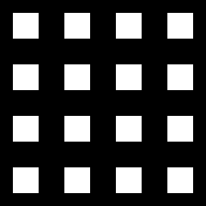

.. Sample Maker utilisation master file.

Utilisation
==============================

.. note::
	**Avant-propos** : Pour une utilisation de python et de différents scripts, un Environnement de développement (IDE) est préférable.

	Pour python, Vous pouvez utiliser :
		- **VSCode** : C'est un *éditeur de texte avancé*.
		  Il est polyvalent et permet de lancer simplement des scripts python.
		  Il possède, en outre, l'avantage d'être utilisable pour de nombreux languages.
		- **PyCharm** : C'est Environnement de développement spécialisé pour Python.
		  Il peut faire peur au néophyte de la programmation, car il possède de nombreuses aides à la programmation.

Le dossier `Examples` possèdent différents fichiers d'utilisation de l'API `SampleMaker`.

Exemple : Générer une pile d'échantillon simple
------------------------------------------------

**Création de la structure de répartition des molécules (le masque)** :
On va choisir une structure composée de carré de 32 pixels sur une image qui fera 256 pixels.
On aura donc un masque de répartition composé de 16 carrés.

.. code-block:: python

	mask = Mask(size, Pattern.from_pattern(PatternType.SQUARES, {"size": 32}))

**Définition du fluorophore** : On va utiliser un fluorophore qui émet une lumière de 600nm et d'une intensité de 5000.
Cette intensité peut varier de 10% et le fluorophore scientille à une vitesse de 50ms.

.. code-block:: python

	fluorophore = Fluorophore(wavelength=600, intensity=5000, delta=10, flickering=50)

**Définition du générateur de bruit** : Les images parfaites d'éxistent pas donc, on va utiliser un générateur de bruit.
On considérer une image bruité possédant un SNR (Signal/Noise Ratio) faible (2.6).
De plus, on considère le bruit de fond du microcope d'une intensité de 500 avec une variation de 20%.

.. code-block:: python

	noiser = Noiser(snr=2.6, background=500, variation=20)

**Définition du générateur d'échantillon** : Le générateur d'échantillon va prendre en considération :
la taille souhaité de l'échantillon, le masque de répartition, le générateur de bruit et le fluorophore.
On ajoute des paramètres d'astigmatisme (permettant de définir une coordonnée axiale),
la taille en nanomètre d'un pixel et la densité de molécules par micromètre carré.

.. code-block:: python

	sampler = Sampler(size=size, pixel_size=160, density=0.25, _astigmatism_ratio=2.0, fluorophore=fluorophore, mask=mask, noiser=noiser)

**Définition du générateur de pile** :
Le générateur de pile va prendre le générateur d'échantillon paramétré et le modèle de pile que l'on souhaite générer
(pour le moment aucun modèle n'est implémenté)

.. code-block:: python

	stacker = Stacker(sampler=sampler)

**Génération de la pile et sauvegarde** :
On choisi combien d'échantillons seront présent sur notre pile lors de la génération puis on sauve le résultat dans un fichier tif.

.. code-block:: python

	stack = stacker.generate(10)
	stack.save(f"Stack.tif")

**Code Complet** :

.. code-block:: python

	from SampleMaker.Fluorophore import Fluorophore
	from SampleMaker.Generator.Noiser import Noiser
	from SampleMaker.Generator.Sampler import Sampler
	from SampleMaker.Generator.Stacker import Stacker
	from SampleMaker.Mask import Mask
	from SampleMaker.Pattern import Pattern, PatternType

	size = 256
	mask = Mask(size, Pattern.from_pattern(PatternType.SQUARES, {"size": 64}))
	fluorophore = Fluorophore(wavelength=600, intensity=5000, delta=10, flickering=50)
	noiser = Noiser(snr=2.6, background=500, variation=20)
	sampler = Sampler(size=size, pixel_size=160, density=0.25, astigmatism_ratio=2.0, fluorophore=fluorophore, mask=mask, noiser=noiser)
	stacker = Stacker(sampler=sampler)
	stack = stacker.generate(10)
	stack.save(f"Stack.tif")